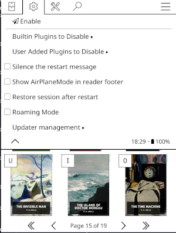

# AirPlaneMode for KOReader

**AirPlaneMode** is a [ KOReader ](https://github.com/koreader/koreader.git) plugin that lets you enable/disable networking and selected plugins in one action. The plugin focuses on safely disabling identified plugins while preserving user plugin preferences when disabling.

---

## 🚀 What it does

- Enabling **AirPlaneMode** will:
  - Back up the current KOReader settings file
  - Disables a configurable set of plugins
  - Disabe Wi‑Fi, and changes default Network settings to disable automatic activation
  - If the Calibre plugin is enabled, adjusts Calibre's wireless-only settings to off while leaving the plugin search functions enabled
- Disabling **AirPlaneMode** will:
  - restore previous settings from the backup
  - re-enables plugins that were disabled for **AirPlaneMode** 
  - Return Wi‑Fi settings to their previous configuration

- On devices where network hardware cannot be managed, Wi‑Fi actions are skipped.

---

## 📥 Installation

#### Installing using a release archive file

1. Download the latest release from [Releases](https://github.com/kodermike/airplanemode.koplugin/releases)
1. Connect your device with USB
1. You can either:
   1. Unpack the release file locally, then copy the `airplanemode.koplugin` directory to `plugins/` or
   1. unpack a release file in your plugins directory. For example,
   - On Kobo, this would be in `.adds/koreader/plugins`
   - On Kindle's it is in `/mnt/us/koreader/plugins`
1. Disconnect your device and restart KOReader. You should be all set!

#### Alternate installation for Kobo's

1. On the [Releases](https://github.com/kodermike/airplanemode.koplugin/releases) page, download `KoboRoot.tgz`.
1. Connect your device with USB
1. Copy the the `KoboRoot.tgz` file to the `.kobo` directory on your mounted kobo.
1. Disconnect USB, then reboot your reader. In order for the `KoboRoot.tgz` file to be unpacked, you will need to exit KOReader completely and restart your Kobo so that the native Kobo manager can unpack the `KoboRoot.tgz` file
1. Once your Kobo is back up, start KOReader again

#### For users of AirPlaneMode >=2.0

- In the configuration menu, you can elect to update **AirPlaneMode** directly from the plugin

## Usage

**AirPlaneMode** registers a menu entry in the Network menu where you can:

- Enable / Disable **AirPlaneMode**

- Manage which builtin and user plugins should be disabled when **AirPlaneMode** is active

- Enable silent restarts (assumes confirmation) so that you aren't prompted to restart

- Toggle **AirPlaneMode** visibility in the reader footer. This option also requires `External Content` in the status bar UI to be included.

- Enable the option to resume where you left off if possible when restarting with **AirPlaneMode**. This option temporarily overrides preferences to resume where you left off when toggling **AirPlaneMode**.

- If available, enable the option to only manage plugins when **AirPlaneMode** is active instead of managing Network as well.

- Open the **AirPlaneMode** update manager

  

## Gesture support

Gestures (Device -> Gestures) can be configured to call **AirPlaneMode** actions; the plugin registers three dispatcher actions you can bind to gestures or hotkeys:

- `airplanemode_enable` — enable AirPlaneMode
- `airplanemode_disable` — disable AirPlaneMode
- `airplanemode_toggle` — toggle AirPlaneMode on/off

## Default disabled plugins

- On first run **AirPlaneMode** populates a default list of plugins to disable while active. The defaults can be overwritten, changed, etc. The initial plugins are:
  - `newsdownloader`
  - `wallabag`
  - `kosync`
  - `opds`
  - `SSH`
  - `timesync`
  - `httpinspector`
  - `calibre` (wireless component only)

Note: **AirPlaneMode's** Plugin Manager only disables plugins inside KOReader while **AirPlaneMode** is active — it does not edit KOReader plugin settings directly.

---

## 🐛 Find a bug?

Please open an issue in GitHub so we can start looking at what isn't working! If possible, please include your `crash.log`, how to reproduce the issue, what kind of hardware you are using, what version of KOReader you are using, as well as a detailed description of what you ran into.

## 🤝 Contributing

Contributions are welcome! Please open issues or PRs on the project's GitHub repository. If submitting a PR, please follow the existing code style and conventions. Please use a fork of the repository and create the PR against the `main` branch if for the current stable release, or the `features` branch if for a new feature or experimental release.

## 🔧 Developer Notes

- **AirPlaneMode** support the `stopPlugin` dispatcher action to stop **AirPlaneMode** from another service or plugin while it is active.
- **AirPlaneMode** also supports the `deletePluginSettings` dispatcher action to delete all AirPlaneMode settings and reset the installation to a clean slate.
- The `features` branch is suitable for testing against nightly KOReader builds. The `main` branch is intended to work with stable releases.
